<div align="center">

#  LOAN WIZARD - team claudeKloud
### Agentic AI Video KYC · Loan Origination System
#### Built for Poonawalla Fincorp · Problem Statement #3

<br/>

[](https://fastapi.tiangolo.com)
[](https://langchain-ai.github.io/langgraph/)
[](https://lightgbm.readthedocs.io)
[](https://react.dev)
[](https://aws.amazon.com)
[](https://supabase.com)
[](https://railway.app)

<br/>

> **"No forms. No branch visits. One video call to loan approval."**
>
> A fully agentic, AI-driven Video KYC platform that takes a personal loan applicant from  
> identity verification to a signed PDF offer letter — in under 12 minutes.

<br/>

| 🎥 Live Video KYC | 🧠 35-Feature AI Model | ⚡ ~12 Min Journey | 🔒 RBI-Ready Audit Trail | 👁️ 7-Layer Fraud Detection |
|:---:|:---:|:---:|:---:|:---:|
| LiveKit WebRTC | LightGBM + SHAP | End-to-End | Immutable Logs | Continuous Scores |

</div>

---

## 📁 Repository Structure

```
agentic_ai_video_KYC/
├── 📂 backend/                    → FastAPI + LangGraph + ML pipeline
│   ├── app/
│   │   ├── api/                   → REST + WebSocket endpoints
│   │   ├── models/                → SQLAlchemy ORM (11 tables)
│   │   ├── schemas/               → Pydantic request/response
│   │   ├── services/              → AI/ML/email/storage services
│   │   └── orchestration/         → LangGraph 8-node pipeline
│   ├── migrations/                → Alembic (5 migrations)
│   ├── models/                    → LightGBM artifacts
│   ├── config/policy_rules.yaml   → Hard rules config
│   └── README.md                  → [Backend docs →](./backend/README.md)
│
├── 📂 fincorp-pathfinder/frontend/
│   ├── src/
│   │   ├── pages/                 → 4 page components
│   │   ├── components/            → Admin + session UI
│   │   └── lib/apiClient.js       → Unified API client
│   ├── server/index.js            → Legacy email relay (Node/Express)
│   └── README.md                  → [Frontend docs →](./fincorp-pathfinder/frontend/README.md)
│
├── docker-compose.yml             → Local dev (backend + LiveKit)
├── PROJECT_DOCUMENTATION.md       → Full technical specification
└── README.md                      → ← You are here
```

---

## 🎯 Problem Statement

Traditional NBFC loan onboarding is broken across every dimension:

| Pain Point | Reality |
|---|---|
| ⏱️ Time to Decision | 3–7 days (branch visits, manual review) |
| 💸 Cost per Application | ₹180–₹400 (manual KYC officer time) |
| 📋 Form Drop-off Rate | 60%+ abandon long digital forms |
| 🚨 Annual NBFC Fraud | ₹2,400 Cr (no real-time liveness/intent checks) |
| 🔲 Intelligence Used | Zero behavioural, CV, or conversational signals |

**Loan Wizard eliminates all five problems simultaneously.**

---

## 🚀 Quick Links
The entire project is deployed on the internet, live running and tested.
| Service | URL | README |
|---|---|---|
| 🔵 **Backend API** | `https://backend-production-8a7a.up.railway.app` | [backend/README.md](./backend/README.md) |
| 🟠 **Frontend App** | `https://frontend-production-d74a.up.railway.app/` | [frontend/README.md](./fincorp-pathfinder/frontend/README.md) |
| 📧 **Email Server** | `https://nodemailer-server-production-36f5.up.railway.app/` | [server/README.md](./fincorp-pathfinder/frontend/server/README.md) |
| 📖 **API Docs** | `https://backend-production-8a7a.up.railway.app/docs` | Swagger UI (auto-generated) |
| ❤️ **Health Check** | `https://backend-production-8a7a.up.railway.app/docs#/default/health_health_get` | Returns `{"status":"ok"}` |

---

## 🏛️ System Architecture

### High-Level Flow

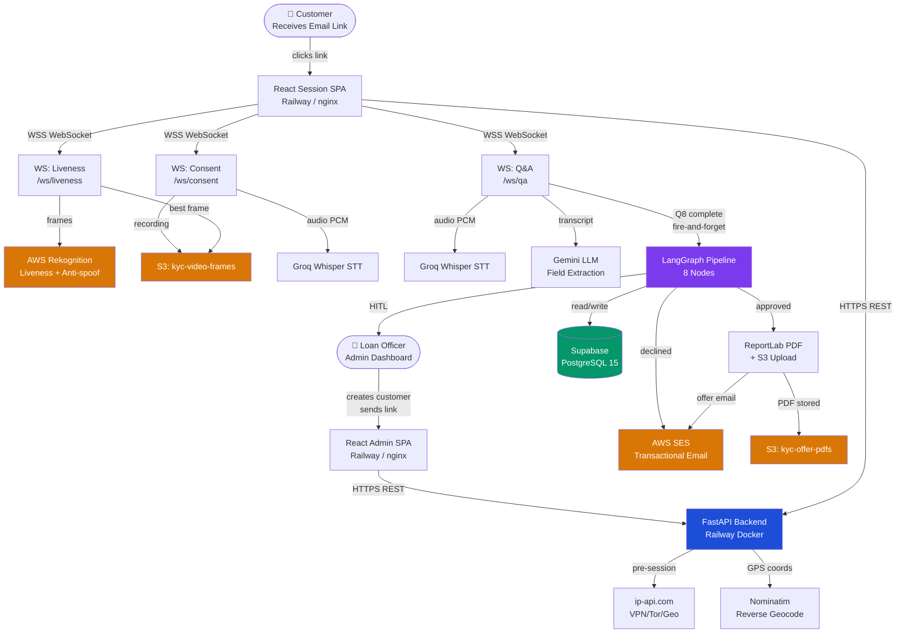

---

### Session State Machine

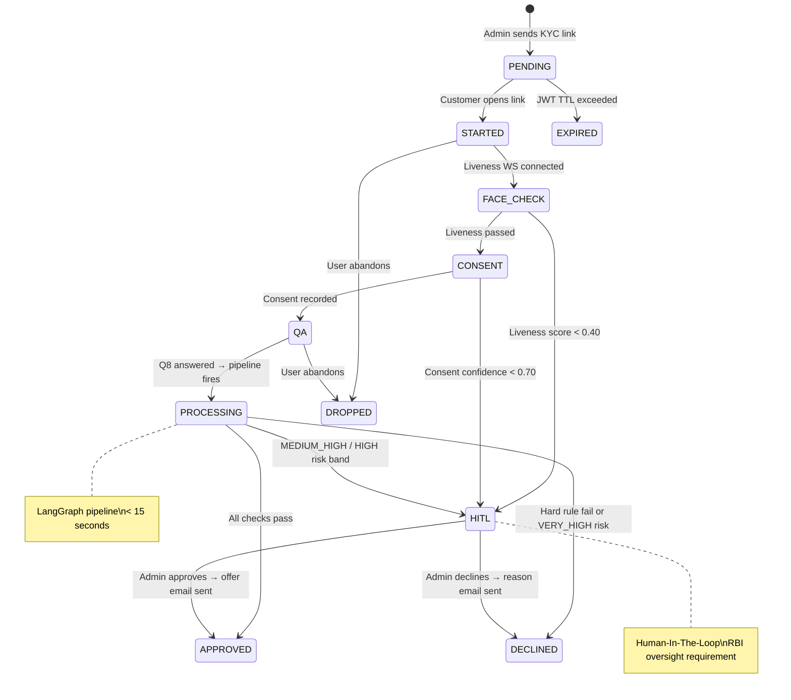

---

### LangGraph Agentic Pipeline

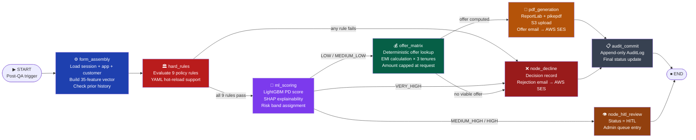

---

### Three-Layer Decision Architecture

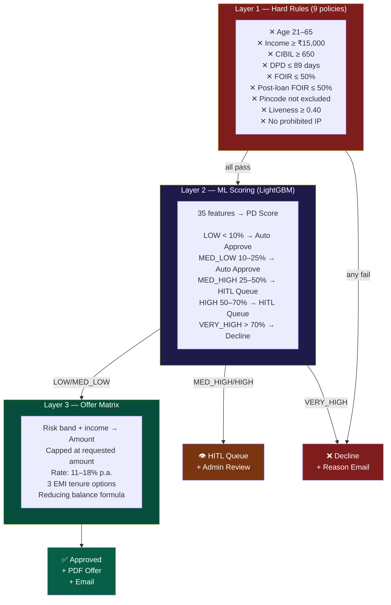

---

## 🧠 AI Intelligence Stack

### The 35-Feature ML Vector

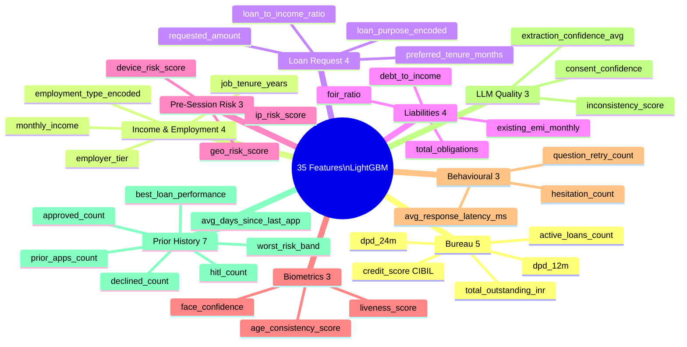

---

### 8-Question Conversational Q&A Protocol

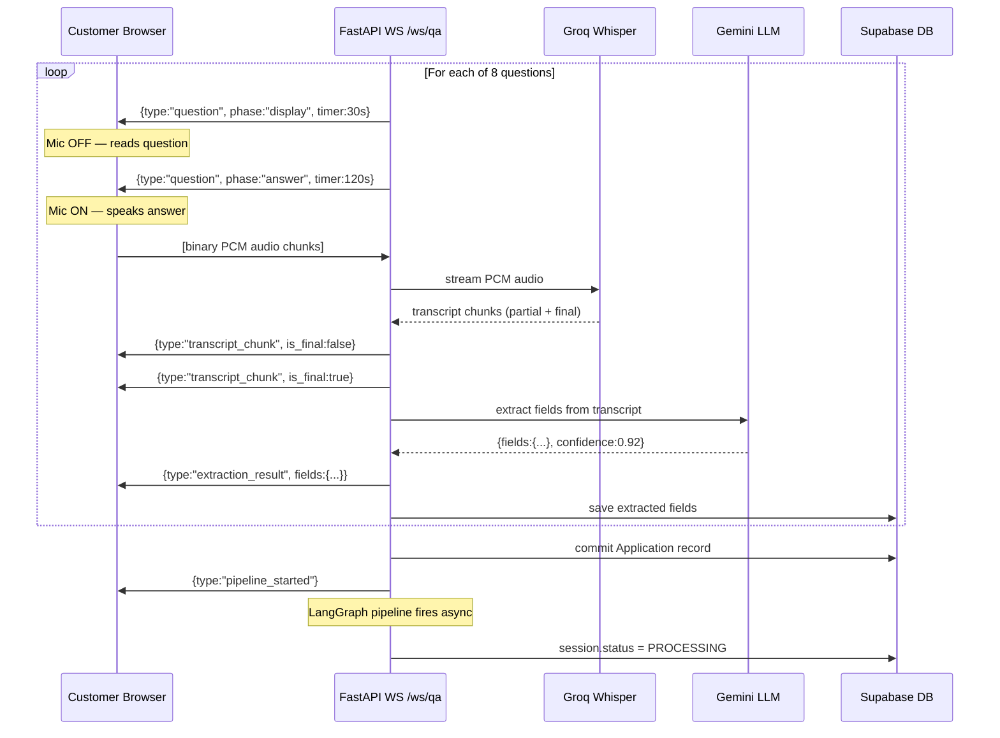

---

### Fraud Detection — 7 Continuous Layers

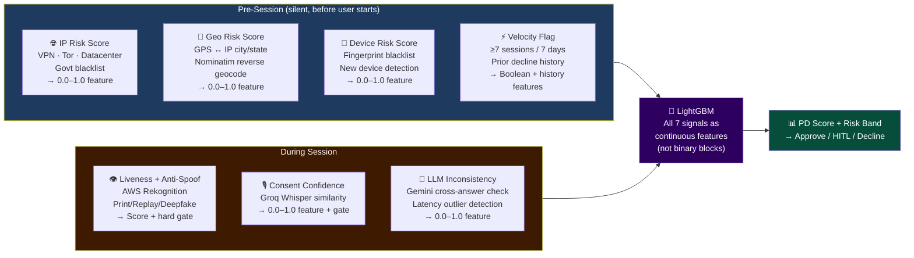

> **Key Design Decision**: Fraud signals are **ML features** (0.0–1.0 continuous), not binary blocks.  
> This means a user with moderate VPN risk isn't auto-rejected — the model weighs all 35 features together.

---

## 🏗️ Infrastructure & Deployment

### Cloud Architecture

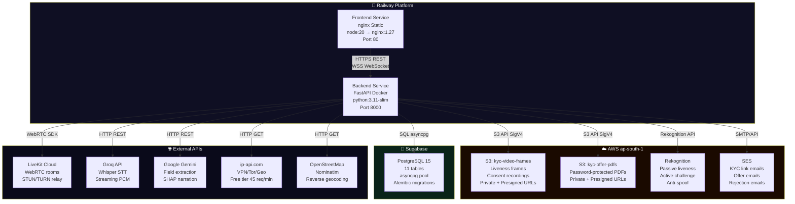

### Deployment Topology

| Service | Platform | Runtime | RAM | Auto-scale |
|---|---|---|---|---|
| **Backend API** | Railway | Docker (python:3.11-slim) | 512MB–1GB | ✅ Yes |
| **Frontend** | Railway | Docker (nginx:1.27) | 256MB | ✅ Yes |
| **Database** | Supabase | PostgreSQL 15 | Managed | ✅ Managed |
| **Media Storage** | AWS S3 | Object storage | Unlimited | ✅ Infinite |
| **Email** | AWS SES | Managed | Managed | ✅ Infinite |

### Backend Startup Sequence

```
Docker container starts
    └─► alembic upgrade head        (run pending migrations)
            └─► uvicorn app.main:app --host 0.0.0.0 --port $PORT --workers 1
                    └─► FastAPI startup events
                            ├─► SQLAlchemy async engine init
                            ├─► LightGBM model load (models/risk_model_v1.lgb)
                            ├─► Calibrator load (models/calibrator.pkl)
                            └─► Health check: GET /health → {"status":"ok"}
```

---

## 📊 Performance & Scalability

### Latency Benchmarks

```
JWT Validation          < 50ms
Pre-session Risk Score  < 400ms   (ip-api + Nominatim)
Groq STT per answer     < 800ms   (streaming)
Gemini LLM extraction   < 1,200ms (per question)
LightGBM inference      < 50ms    (35 features)
Full PDF generation     < 3,000ms (ReportLab + S3 upload)
Full pipeline (post-QA) < 15s     (all 8 nodes)
End-to-end session      ~12 min   (customer-paced)
```

### Scalability Profile

| Metric | Current (Railway Starter) | Scaled (Railway Pro) |
|---|---|---|
| Concurrent WS sessions | ~50 | ~500+ |
| API requests/sec | ~100 | ~1,000+ |
| DB connections | 20 (asyncpg pool) | 100+ (PgBouncer) |
| Pipeline throughput | ~10 concurrent | ~100 (inference service) |
| Storage | Unlimited (S3) | Unlimited (S3) |

### Cost at Scale

| Volume | Estimated Cost |
|---|---|
| 1,000 sessions/month | ~$25/month (~₹0.20/session) |
| 100,000 sessions/month | ~$700/month (~₹0.60/session) |
| Manual KYC (baseline) | ₹180–₹400/session |

> **98% cost reduction** vs manual KYC at scale.

---

## 🔒 Security & Compliance

### Authentication Architecture

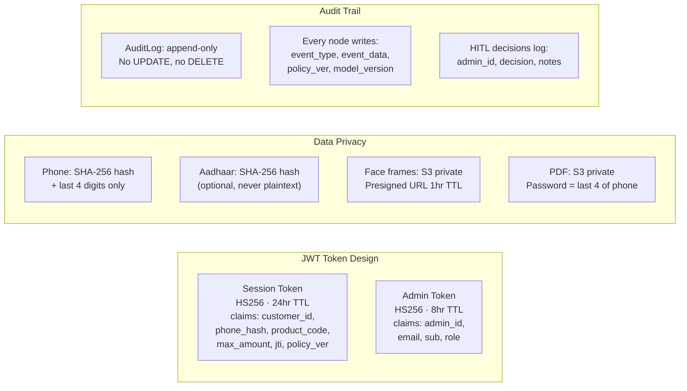

### Compliance Checklist

| Requirement | Implementation | Status |
|---|---|---|
| Human oversight (RBI) | HITL queue for MEDIUM_HIGH/HIGH risk | ✅ |
| Consent recording | Audio stored in S3 with hash + timestamp | ✅ |
| Immutable audit trail | Append-only AuditLog per pipeline node | ✅ |
| Model versioning | `model_version` in every Decision record | ✅ |
| Policy versioning | `policy_ver` in every JWT + audit entry | ✅ |
| Data minimisation | Phone/Aadhaar hashed; no unnecessary PII | ✅ |
| Document security | PDF password-protected + SHA-256 hash | ✅ |
| Access control | JWT-gated all endpoints; bcrypt admin auth | ✅ |

---

## 🧩 Database Schema

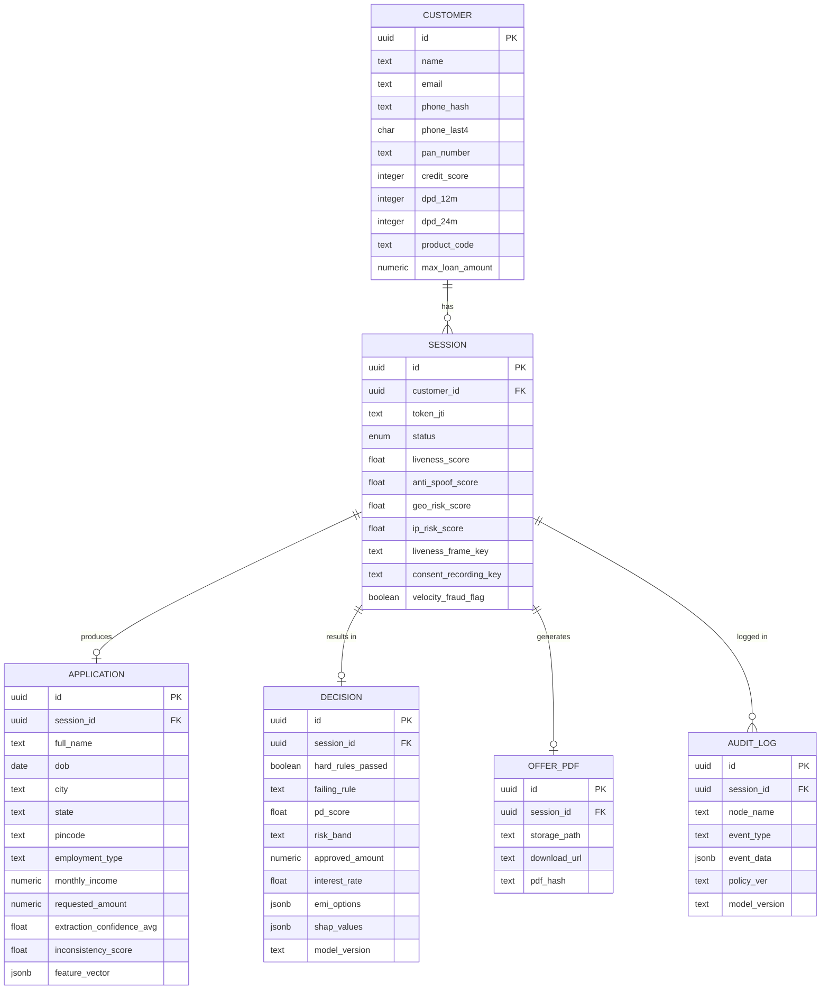

---

## 🎯 Judging Criteria Alignment

<details>
<summary><b>✅ 3.1 End-to-End Digitisation</b></summary>

| What we built | Evidence |
|---|---|
| Zero paper, zero branch | JWT link → video → decision in one flow |
| 10-step fully digital journey | Welcome → Liveness → Consent → PAN → Q&A → Processing → Decision |
| Paperless offer delivery | Password-protected PDF emailed via AWS SES |
| Admin dashboard with live polling | 30s auto-refresh, manual refresh, send/resend links |
| Automated email on every event | KYC link, offer, rejection — all via AWS SES |

</details>

<details>
<summary><b>✅ 3.2 Accuracy & Compliance</b></summary>

| What we built | Evidence |
|---|---|
| Immutable audit log | Append-only AuditLog, every LangGraph node |
| Policy version traceability | `policy_ver` in every JWT token and audit entry |
| Model version traceability | `model_version` in every Decision record |
| Human oversight (HITL) | MEDIUM_HIGH/HIGH risk → admin queue, RBI-compliant |
| Consent hash + recording | SHA-256 hash + S3 audio + Whisper transcript |
| PDF tamper detection | SHA-256 of PDF bytes stored in DB |

</details>

<details>
<summary><b>✅ 3.3 Risk Mitigation</b></summary>

| What we built | Evidence |
|---|---|
| 7 fraud detection layers | IP risk, geo risk, device risk, liveness, consent, velocity, LLM inconsistency |
| Continuous scores (not binary gates) | All signals are 0.0–1.0 features fed into LightGBM |
| Anti-spoof detection | AWS Rekognition: print attack, replay, deepfake |
| Location mismatch detection | GPS → Nominatim reverse geocode vs ip-api.com city/state |
| 9 hard policy rules | Any failure → immediate decline with specific reason |
| Velocity fraud flag | ≥7 sessions/phone/7 days → HITL pause |

</details>

<details>
<summary><b>✅ 3.4 Intelligence & Personalisation</b></summary>

| What we built | Evidence |
|---|---|
| 35-feature ML model | 9 feature groups: bureau, income, loan, liabilities, risk, biometrics, behaviour, LLM, history |
| Gemini LLM extraction | Per-question structured field extraction with confidence scores |
| SHAP explainability | Top 3 positive + negative features per decision, narrated in plain English |
| Offer capped at request | `approved_amount = min(computed_amount, requested_amount)` |
| Personalised EMI options | 3 tenures computed via reducing balance formula |
| HITL for nuanced cases | Borderline risk (MEDIUM_HIGH/HIGH) gets human review, not auto-decline |

</details>

<details>
<summary><b>✅ 3.5 Scalability & Reliability</b></summary>

| What we built | Evidence |
|---|---|
| Async FastAPI + asyncpg | Non-blocking I/O throughout |
| LangGraph with DB checkpointing | AsyncPostgresSaver — pipeline resumable on crash |
| S3 for all media | No database bloat; unlimited scale |
| Stateless API layer | Horizontal scaling ready |
| Railway auto-scaling | Both services configured for auto-scale |
| FastAPI BackgroundTasks | Email sending non-blocking (uses FastAPI BackgroundTasks) |
| < 15s decision pipeline | LightGBM inference < 50ms; full pipeline < 15s |

</details>

---

## 🔑 Why Loan Wizard Wins

| Dimension | Loan Wizard | Typical NBFC Solution |
|---|---|---|
| **Fraud signals** | 7 continuous ML features | Binary checks (pass/fail) |
| **Prior history** | 7-feature history vector | Ignored |
| **Feature depth** | 35 features, 9 groups | 10–15 features |
| **Offer amount** | Capped at customer's request | May over-offer |
| **Explainability** | SHAP per-prediction narration | Black box |
| **Offer generation** | Deterministic matrix | LLM-generated (unreliable) |
| **Decline reason** | Specific rule or PD score | Generic message |
| **Human oversight** | HITL queue with email notification | Manual callback |
| **Audit trail** | Per-node immutable log | Request-level only |
| **Pipeline resilience** | DB-checkpointed, resumable | Stateless, restarts from scratch |

---

## 🛠️ Local Development Setup

### Prerequisites

```bash
# Required
Python 3.11+
Node.js 20+
Docker + Docker Compose
PostgreSQL 15 (or Supabase project)

# Optional for full local setup
LiveKit server (docker-compose includes it)
```

### 1. Clone & Configure

```bash
git clone https://github.com/your-org/agentic_ai_video_KYC.git
cd agentic_ai_video_KYC
```

### 2. Backend Setup

```bash
cd backend
cp .env.example .env        # fill in your credentials
pip install -r requirements.txt
alembic upgrade head        # run migrations
uvicorn app.main:app --reload --port 8000
```

### 3. Frontend Setup

```bash
cd fincorp-pathfinder/frontend
cp .env.example .env        # set VITE_API_BASE_URL=http://localhost:8000
npm install
npm run dev                 # starts on http://localhost:3000
```

### 4. With Docker Compose (Backend + LiveKit)

```bash
docker-compose up           # backend on :8000, LiveKit on :7880
```

### 5. Environment Variables

See [backend/README.md](./backend/README.md#environment-variables) and  
[frontend/README.md](./fincorp-pathfinder/frontend/README.md#environment-variables)  
for complete environment variable references.

---

## 📧 Email Notification Flow

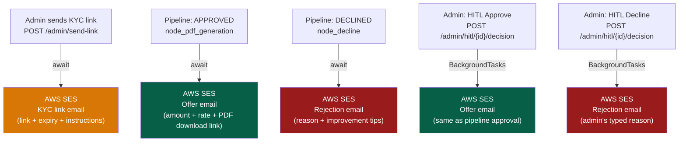

---

## 🤝 Team

| Name | Role |
|---|---|
| **Aryan** | Backend · ML Pipeline · LangGraph · Infra · Integration |
| **Atharva** | Railway · AWS · API Design |
| **Moksh** | ML model · Frontend · Admin Dashboard · UX |

---

## 📄 License

Built for Poonawalla Fincorp Hackathon · Problem Statement #3  
Internal use only · Not for public distribution

---

<div align="center">

**"AI extracts. AI scores. Rules decide. Every outcome is explainable, auditable, and compliant."**

*Loan Wizard doesn't replace the loan officer's judgement —  
it gives them everything they need to make better decisions, faster.*

[](https://fastapi.tiangolo.com)
[](https://langchain-ai.github.io/langgraph/)
[](https://aws.amazon.com)
[](https://supabase.com)
[](https://railway.app)

</div>
